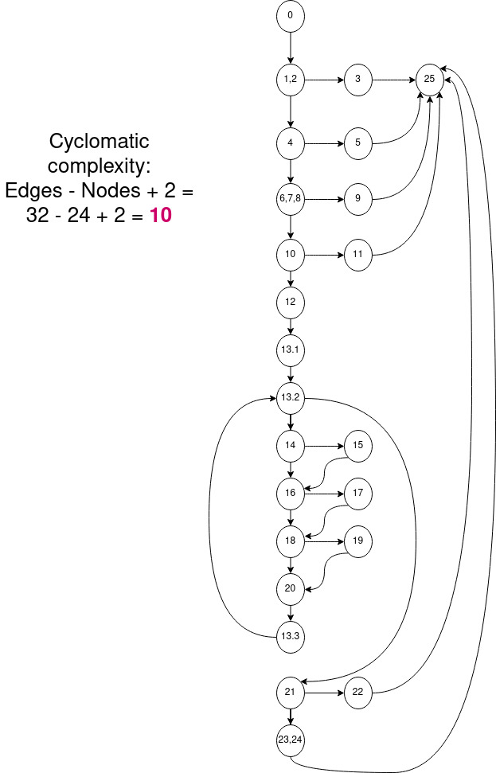

# Втора лабораториска вежба по Софтверско инженерство

## Виктор Јовев, бр. на индекс 186068

### Група на код: 

Код група: 3

###  Control Flow Graph

 

### Цикломатска комплексност

Nodes - Edges + 2 = 32 - 24 + 2= 10  
цикломатска комплексност е 10

### Тест случаи според критериумот  Every statement 

....

### Тест случаи според критериумот Multiplie Condition

.... 

### Објаснување на напишаните unit tests

...
...
